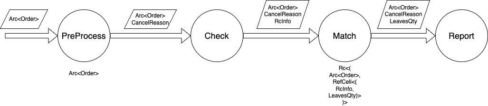

<!--
_paginate: false
-->
<br/>
<br/>
<br/>
<br/>

# Rust Instroduce & Application

---

<!-- _header: Simple Example -->
```rust
fn main() {
    let name = String::from("Jerry");
    hello(name);
    bye(name);
}

fn hello(s : String) {
    println!("Hello {} !", s);
}

fn bye(s : String) {
    println!("Bye {} !", s);
}
```

---
<!-- _header: History of Rust Development -->

* Rust started as a personal project by Mozilla employee Graydon Hoare.
* In 2009, it began receiving funding from Mozilla Research.
* Version 1.0 was released on May 15, 2015.
* Version release history:
  * 2015: 1.5
  * 2016: 1.14
  * 2017: 1.22
  * 2018: 1.31
  * 2019: 1.40
  * 2020: 1.49
  * 2021: 1.57
  * 2022: 1.66
  * 2023: 1.67
* A new iteration version is released every 6 weeks.
* A new major version is released every 2-3 years: Rust 2018 edition (1.31), Rust 2021 edition (1.56).

---
<!-- _header: Language Features -->

* High Performance  
  * Rust delivers impressive speed and highly efficient memory usage. Without runtime or garbage collection, it excels in performance-critical services, can run on embedded devices, and integrates seamlessly with other languages.  
* Reliability  
  * Rust’s rich type system and ownership model ensure memory safety and thread safety, enabling you to eliminate various errors at compile time.  
* Productivity  
  * Rust offers excellent documentation, a friendly compiler with clear error messages, and top-notch tools, including a package manager and build system, intelligent auto-completion and type checking for multi-editor support, and automatic code formatting.  

---

<!-- _header: Applications -->

* Front-end development: Rust is the top choice for WASM development according to *The State of WebAssembly 2022*.  
* Linux has listed Rust as an officially supported kernel development language, making it the second language after C to be supported for kernel development.  
* Rust has become the preferred development language for blockchain platforms globally.  
* Google extensively uses Rust, not only in certain modules of the Android system but also in its latest operating system, Fuchsia.  
* AWS has been using Rust to implement its serverless computing platform since 2017.  
* TiDB, the most well-known open-source distributed database in China, is built with Rust.  
---

<!-- _header: Variable Mutability -->

* By default, variables in Rust are immutable. To make a variable mutable, you must explicitly declare it with the `mut` keyword.

    ```rust
    fn main() {
        let x = 5;
        println!("The value of x is: {}", x);
        x = 6; // Compilation error: cannot assign twice to immutable variable `x`
        println!("The value of x is: {}", x);

        let mut y = 6;
        println!("The value of y is: {}", y);
        y = 8;
        println!("The value of y is: {}", y);
    }
    ```

* Differences between immutable variables and constants:
  * Constants are determined at compile time.
  * Immutable variables are determined when they are first bound at runtime.
* Immutable variables enhance safety by preventing unintended modification.
  * For example, in message handlers, most scenarios only require reading the content of the message without modifying it.

---

<!-- _header: Ownership -->
* In Rust, every value is owned by a variable, and the variable is called the owner of the value.
* A value can only be owned by one variable at a time, or in other words, a value can have only one owner.
* When the owner (variable) goes out of scope, the value will be dropped.

```rust
fn main() {
  let x = 32;
  let y = x;
  println!("{}", x);  // Ok

  let str1 = String::from("Jerry");
  let str2 = str1;
  println!("{}", str1);  // Compile error: value borrowed here after move

  let o1 = Order {price: 110, qty: 40};
  let o2 = o1;
  println!("{}", o1.price);  // Compile error
}
struct Order {
  price: i64,
  qty: u64
}
---

<!-- _header: Ownership -->
* Passing a value to a function transfers ownership.

```rust
fn main() {
    let name = String::from("Jerry");
    hello(name);
    bye(name);  // compile error
}

fn hello(s : String) {
    println!("Hello {} !", s);
}

fn bye(s : String) {
    println!("Bye {} !", s);
}

```

---
<!-- _header: Ownership -->
* Returning a value from a function transfers ownership.

```rust
fn main() {
  let name = String::from("Jerry");
  let s = hello(name);
  println!("{}", s);
}

fn hello(s : String) -> String {
  s.push_back(", hello");
  s
}
```

---
<!-- _header: Ownership -->
* Rust prioritizes move semantics, while C++ prioritizes copy semantics.
* In C++, referencing a variable after it has been moved will compile successfully but may result in a runtime error (core dump).

```c++
std::unique_ptr<int> upt;
upt.reset(new int);
*upt = 5;

auto upt1 = std::move(upt);
*upt = 6;  // compile ok, running coredump
```

---

<!-- _header: References and Borrowing -->

* Taking a reference to a variable is called borrowing.  
* Immutable references:

```rust
fn main() {
    let s1 = String::from("hello");

    let len = calculate_length(&s1);

    println!("The length of '{}' is {}.", s1, len);
}

fn calculate_length(s: &String) -> usize {
    s.len()
}
```

* Mutable references

```rust
fn main() {
    let mut s = String::from("hello");

    change(&mut s);
}

fn change(some_string: &mut String) {
    some_string.push_str(", world");
}
```

---
<!-- _header: References and Borrowing -->
* Borrowing rules:
	*	Any number of immutable references can exist.
	*	Only one mutable reference is allowed at a time.
	*	Mutable and immutable references cannot coexist.

---
<!-- _header: References and Borrowing -->

```rust
fn main() {
  let mut r = 10;

  // Multiple immutable references can exist
  let r1 = &r;
  let r2 = &r;  // OK
  println!("{} {}", r1, r2); 

  // Multiple mutable references cannot exist
  let r1 = &mut r;
  let r2 = &mut r; // compile error: second mutable borrow occurs here
  println!("{} {}", r1, r2);

  let r1 = &mut r;
  println!("{}", r1);
  let r2 = &mut r;  // OK
  println!("{}", r2); 

  // Immutable and mutable references cannot coexist
  let r1 = &r;
  let r2 = &mut r;  // compile error
  println!("{} {}", r1, r2); 

  // When there is a mutable reference, the original variable cannot be accessed
  let t = 10;
  let t1 = &mut t;
  println!("{} {}", t, t1); 

}
```

---
<!-- _header: References and Borrowing -->

* The compiler guarantees that dangling references will not occur

```rust
fn main() {
  let x : &mut i32;
  {
    let mut y = 1000;
    x = &y; // compile error : borrowed value does not live long enough
  }
  println!("{}", x);
}
```

---
<!-- _header: References and Borrowing -->
*	Borrow checking is limited to single-threaded checks and does not apply to cross-thread data sharing (other mechanisms ensure safety).
*	However, in a single thread, situations like “simultaneous reads/writes to a variable at the same time” do not occur, avoiding data races.
*	So, what is the purpose of borrow checking?

```rust
fn main() {
  let mut buf = vec![1,2,3,4];

  for i in &buf {
      buf.push(*i); // This will break very quickly
  }
}
```

---

<!-- _header: References and Borrowing -->

* Strict borrow checking prevents the use of many design patterns commonly used in other languages, forcing beginners to “struggle” with the compiler’s borrow checker right from the start.

```rust
struct Logger {
}
impl Logger {
  fn new() -> Logger {}
  fn write(&mut self, s : &str){}
}
struct OrderProcessor{
  logger : &mut Logger,
}
impl OrderProcessor {
  fn new(logger : &mut Logger) -> OrderProcessor  { OrderProcessor{logger : logger}}
}
struct ExecutionProcessor{
  logger : &mut Logger,
}
impl ExecutionProcessor {
  fn new(logger : &mut Logger) -> ExecutionProcessor { ExecutionProcessor {logger : logger} }
}
fn main() {
  let mut logger = Logger::new();
  let op = OrderProcessor::new(&logger);
  let ep = OrderProcessor::new(&logger);
  ......
}
```

---

<!-- _header: References and Borrowing -->

* Borrow checking can be deferred to runtime to allow multiple references.

```rust
use std::cell::RefCell;
struct Logger {
}
impl Logger {
  fn new() -> Logger { Logger {} }
  fn write(&mut self, s : &str){}
}
struct OrderProcessor<'a>{
  logger : & 'a RefCell<Logger>,
}
impl OrderProcessor<'_> {
  fn new(logger : &RefCell<Logger>) -> OrderProcessor  { OrderProcessor {logger : logger}}
  fn do_business(&mut self) {
    // do some business process
    self.logger.borrow_mut().write("test")
  }
}
struct ExecutionProcessor<'a>{
  logger : & 'a RefCell<Logger>,
}
impl ExecutionProcessor<'_>  {
  fn new(logger : &RefCell<Logger>) -> ExecutionProcessor { ExecutionProcessor{ logger : logger}}
  fn do_business(&mut self) {
    // do some business process
    self.logger.borrow_mut().write("test")
  }
}
fn main() {
  let logger = RefCell::new(Logger::new())
  let mut op = OrderProcessor::new(&logger);
  let mut ep = OrderProcessor::new(&logger);
  op.do_business();
  ep.do_business();
}
```

---

<!-- _header: References and Borrowing -->

* Runtime borrow checking does not weaken the strictness of the checks.

```rust
let buf = RefCell::new(vec![1,2,3,4]);

for i in &*buf.borrow() {
    buf.borrow_mut().push(*i); // // thread 'main' panicked at 'already borrowed: BorrowMutError'
}
```

---

<!-- _header: References and Borrowing -->

* Borrow checking can sometimes be overly strict or inaccurate in certain situations.

```rust
fn foo<T>(vec: &mut Vec<T>) -> &T {
  let r = &vec[0];
  if some_condition(r) {
    return r;
  }
  
  // Question: can we mutate `vec` here? On Nightly,
  // you get an error, because a reference that is returned (like `r`)
  // is considered to be in scope until the end of the function,
  // even if that return only happens conditionally. Polonius can
  // accept this code.
  vec.push(...);
}
```


---
<!-- _header: Heap Memory Management -->

* C++ : new、malloc
*	Rust: Memory can only be allocated through smart pointers

```rust
fn main() {
  let order = Box::new(Order {price : 100, qty : 50});
  println!("order qty is {}", order.qty);
  println!("order pirce is {}", order.price);
}

struct Order {
  price : i64,
  qty : u64
}
```

---

<!-- _header: Smart Pointers -->
|Rust|C++|说明|
|-|-|-|
|Box|unique_ptr|Exclusive ownership of a resource|
|Rc||Reference-counted shared resource (not thread-safe)|
|Arc|shared_ptr|Reference-counted shared resource (thread-safe)|
|Weak|weak_ptr|Weak pointer to avoid reference cycles|

---

<!-- _header: Smart Pointers -->

* Rc and Arc
* If you try to pass an Rc across threads, the compiler will throw an error

```rust
use std::rc::Rc;
fn main() {
    let a = Rc::new(String::from("hello, world"));
    let b = Rc::clone(&a);

    assert_eq!(2, Rc::strong_count(&a));
    assert_eq!(Rc::strong_count(&a), Rc::strong_count(&b))
}

```

```rust
use std::sync::Arc;
use std::thread;

fn main() {
    let s = Arc::new(String::from("Multi-threaded Wanderer"));
    for _ in 0..10 {
        let s = Arc::clone(&s);
        let handle = thread::spawn(move || {
           println!("{}", s)
        });
    }
}
```

---

<!-- _header: Smart Pointers -->

* To ensure compliance with borrow checking rules, both Rc and Arc are immutable references. Programs cannot modify the values they point to; only read operations are allowed.
* To modify the value pointed to by Rc, it must be used in conjunction with RefCell.

```rust
use std::cell::RefCell;
use std::rc::Rc;
fn main() {
    let s = Rc::new(RefCell::new("I am quite changeable and have multiple owners".to_string()));

    let s1 = s.clone();
    let s2 = s.clone();
    s2.borrow_mut().push_str(", on yeah!");

    println!("{:?}\n{:?}\n{:?}", s, s1, s2);
}
```
---

<!-- _header: Smart Pointers -->

* Modifying the value pointed to by Arc requires using Mutex, with each access requiring a lock.

```rust
use std::sync::{Arc, Mutex};
use std::thread;

fn main() {
    let counter = Arc::new(Mutex::new(0));
    let mut handles = vec![];

    for _ in 0..10 {
        let counter = Arc::clone(&counter);
        let handle = thread::spawn(move || {
            let mut num = counter.lock().unwrap();

            *num += 1;
        });
        handles.push(handle);
    }

    for handle in handles {
        handle.join().unwrap();
    }

    println!("Result: {}", *counter.lock().unwrap());
}
```

---

<!-- _header: Enum Types -->

* Rust enums differ from enums in other languages in the following ways:
  * Rust enums can contain data rather than just representing an integer value.
  * Rust enums can be of any type, not limited to integer types.
  *	Rust enums can include values of different types.

*	A simple example of a Rust enum:

```rust
enum Color {
  Red,
  Green,
  Blue,
}
```

---
<!-- _header: Enum Types -->

* Enum variants can hold data.
* Variants in enums can be matched using pattern matching.

```rust
enum Message {
  Quit,
  Move { x: i32, y: i32 },
  Write(String),
  ChangeColor(i32, i32, i32),
}
fn handle_message(msg: Message) {
    match msg { // All enum variants must be matched; "_" can be used for others.
        Message::Quit => {}
        Message::Move { x, y } => {}
        Message::Write(text) => {}
        Message::ChangeColor(r, g, b) => {}
    }
}
fn main() {
    let msg = Message::Write(String::from("Hello"));
    handle_message(msg);

    let msg = Message::Move { x: 10, y: 20 };
    handle_message(msg);

    let msg = Message::ChangeColor(0, 160, 255);
    handle_message(msg);


    let msg = Message::Quit;
    handle_message(msg);

    println!("Hello");
}
```

---

<!-- _header: Option -->

* Rust does not have a null keyword to represent the absence of a value.
* Rust uses the Option enum to handle nullability.
* The Option enum has two variants: one represents a value, Some(T), and the other represents no value, None.
* T is a generic parameter, meaning Some(T) can contain any type of data.


```rust
enum Option<T> {
    Some(T),
    None,
}
```

---
<!-- _header: Option -->

* Example usage of Option:

```rust
fn find(data : vec<i32>, target : i32) -> Option<i32> {
    for (i, v) in data.iter().enumerate() {
        if *v == target {
            return Some(i as i32);
        }
    }
    None
}

fn main() {
    let data = vec![1, 2, 3, 4, 5];
    let target = 3;
    let result = find(data, target);
    match result {
        Some(index) => println!("Found {} at index {}", target, index),
        None => println!("{} not found", target),
    }
}

```

---

<!-- _header: Result -->

* The generic parameter T represents the type of the value stored when the operation is successful (Ok(T)), while E represents the type of the error value (Err(E)).

```rust
enum Result<T, E> {
    Ok(T),
    Err(E),
}
```
```rust
use std::fs::File;

fn main() {
    let f = File::open("hello.txt");

    let f = match f {
        Ok(file) => file,
        Err(error) => {
            panic!("Problem opening the file: {:?}", error)
        },
    };
}
```

---

<!-- _header: unsafe mode -->

* Rust provides an unsafe mode to bypass compiler checks.
* One important feature of unsafe mode is the ability to use raw pointers.

```rust
fn main() {
    let mut num = 5;

    let r1 = &num as *const i32;

    unsafe {
        println!("r1 is: {}", *r1);
    }
}
```

---

<!-- _header: System Applications -->

* Delegated memory management design in Rust (safe, reliable, and high performance):
  * Ensures minimal data access permissions per thread.
  * Data access shared across multi-stage pipelines does not require locking.



---
<!-- _header: System Applications -->

* Performance Testing
  * Simulated four-stage trading engine pipeline processing:
    * PreProcess: Duplicate order checking and cancellation processing.
    * Check: No processing.
    * Match: Continuous matching.
    * Report: Internal and external binary message generation for reporting.
  * Test Data:
    * Randomly generated 50 million orders (30% active cancellations).
  * Test Results:
    * Processing completed in 147.95 seconds, with a throughput of 337.8k orders/second.
    * Approximately 130 million reports generated, with a match rate of around 53%.
  * Meets system performance requirements.

---
<!-- _header: Summury-->

* Performance: Outstanding, on par with C and C++.
* Memory Safety: Exceptional.
* Tooling: Strong package manager and build tools, making project management and third-party library integration convenient.
* Modern Language Features: Includes type inference, object-oriented programming, generics, concurrency, functional programming, and a unit test framework.
* Development Experience: Smooth coding experience using VSCode with the Rust Analyzer plugin.
* Learning Curve: Significantly steep compared to other languages.
* Borrow Checker: Sometimes overly strict.
* Versioning: Frequent updates, occasionally causing incompatibilities with older versions.


